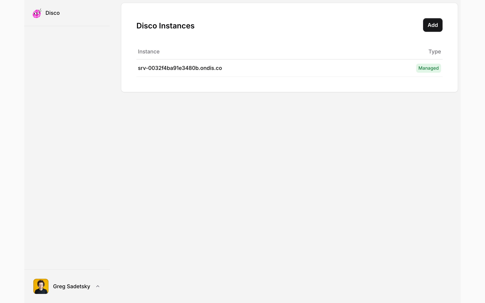
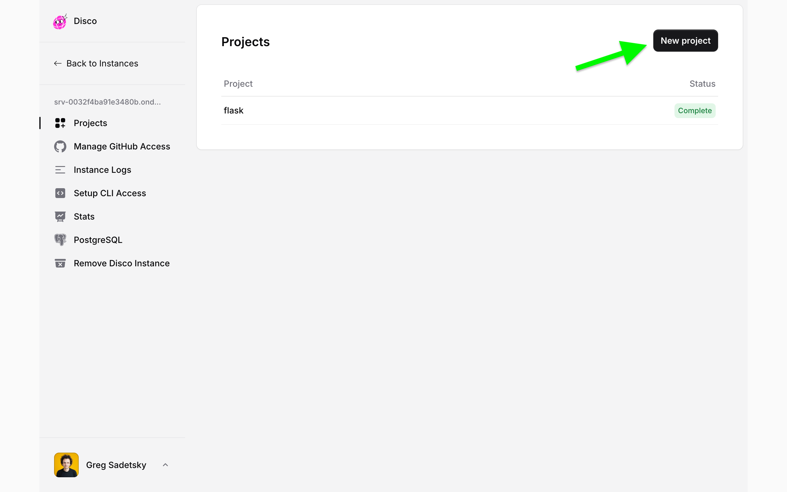
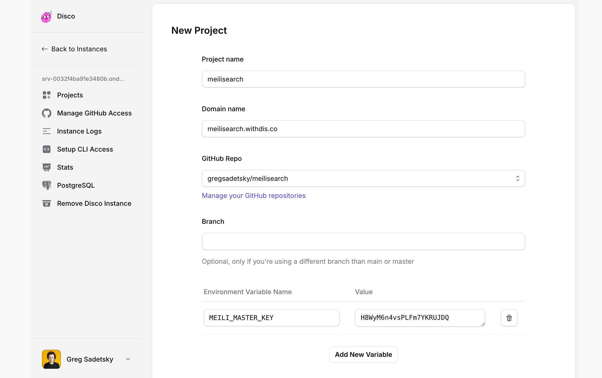
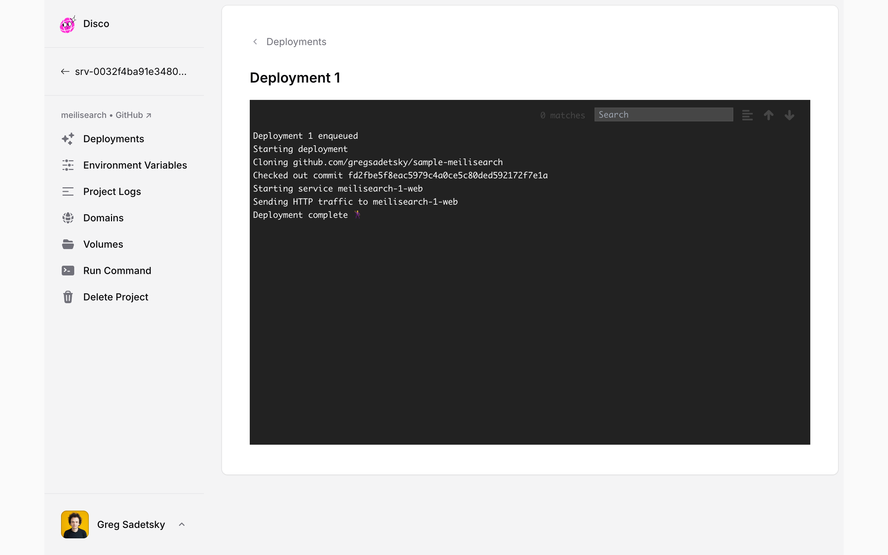
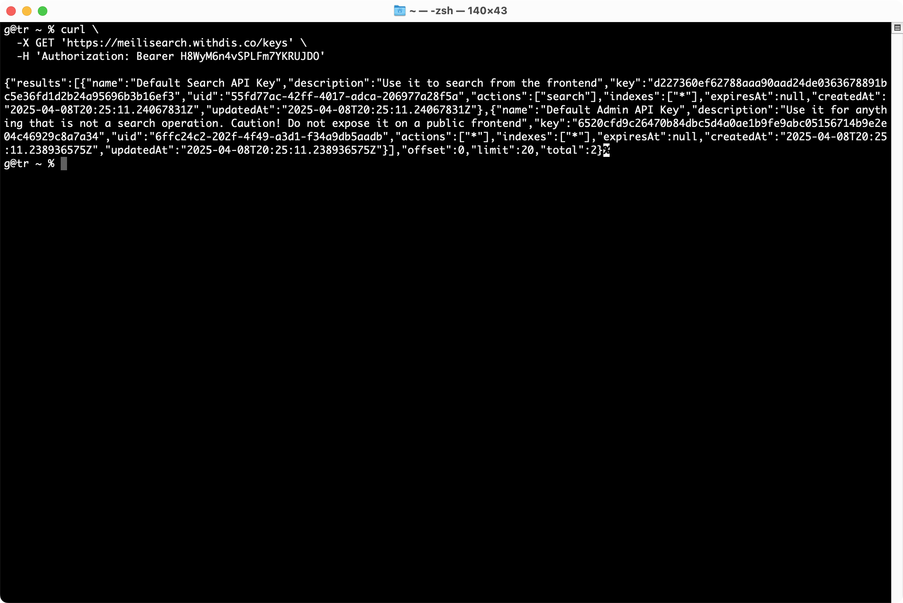

# Meilisearch

## Deploy a Meilisearch instance on Disco

Start by forking the [Meilisearch Disco Sample repo](https://github.com/letsdiscodev/sample-meilisearch) on GitHub.

Login to the [Disco web interface](https://dashboard.disco.cloud/) to see your list of instances. If you don't have an instance yet, follow the instructions to create one.



Click your instance. Then, click "New project" in the upper-right corner.



Next, fill out the form:

- Give this project a name such as `meilisearch`
- Set the domain name for your Meilisearch instance. This domain should be pointing to your Disco instance (e.g. `meilisearch.example.com`)
- Select the GitHub repository you forked earlier. If you need to give Disco access to this repository, click the "Manage your GitHub repositories" link.
- Finally, click "Add New Variable". The name of the variable should be `MEILI_MASTER_KEY` and the value should be a strong key to secure your Meilisearch instance.



Click "Add Project" to create the project.


Your Meilisearch instance will then be deployed.



Navigate to your domain name in your browser. You should see the Meilisearch welcome page.


## Next Steps

Fetch the API keys for your Meilisearch instance by making a `curl` call to your instance:

```bash
curl \
  -X GET 'https://MEILISEARCH_DOMAIN/keys' \
  -H 'Authorization: Bearer MASTER_KEY'
```

Replace `MEILISEARCH_DOMAIN` with your domain name and `MASTER_KEY` with the key you set when creating the project.

You should get back a list of your Meilisearch instance API keys. Using these, you can create and manage your indexes, documents, and settings.


